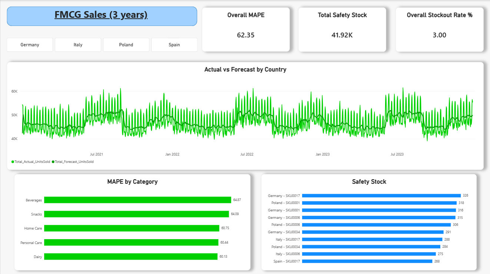
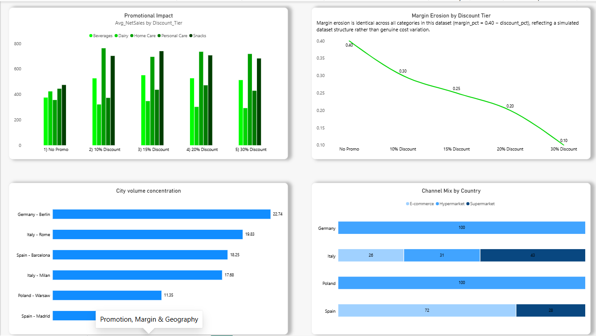

# FMCG-Demand-Planning-Forecasting-SQL-PowerBI

Demand planning and forecasting analysis across 4 European countries using T-SQL and Power BI — rolling forecasts, safety stock modeling, and promotional impact on a 1.1M-row FMCG dataset.

## Project Details

- **Dataset:** FMCG Multi-Country Sales (Kaggle) — 1.1 million rows, 33 columns, daily granularity, 3 full years
- **Scope:** Italy, Spain, Germany, Poland (4 of the dataset's original countries; ~77% of total rows, chosen for combined volume, SKU coverage, and a north/south climate spread for weather testing)
- **Table:** `FMCG_Table`
- **Tools:** T-SQL (SSMS), Power BI Desktop, GitHub, Upwork, LinkedIn
- **Row range:** March 2021 – 2023 (3 full years, daily)

## Repository Structure

```
├── SQL/
│   ├── Query1_Rolling_7_Day_Demand_Forecast_vs_Actual.sql
│   ├── Query1A_Rolling_7_Day_Demand_Forecast_vs_Actual.sql
│   ├── Query2_Forecast_Accuracy_MAPE_by_Category.sql
│   ├── Query3_Demand_Volatility_and_Safety_Stock_by_SKU.sql
│   ├── Query4_Stockout_Frequency_and_Its_Relationship_to_Lead_Time.sql
│   ├── Query5_Promotion_Impact_on_Demand.sql
│   ├── Query6_Weather_Sensitivity_by_Category.sql
│   ├── Query7A_Country_City_Demand_Concentration_AND_Channel_Mix.sql
│   ├── Query7B_Country_City_Demand_Concentration_AND_Channel_Mix.sql
│   └── Query8_Margin_Erosion_from_Discounting.sql
├── PowerBI/
│   └── FMCG_Sales_3Years.pbix
├── Screenshots/
│   ├── Screenshot1_Forecast_and_Risk.png
│   └── Screenshot2_Promotion_Margin_Geography.png
└── README.md
```

**Note on Query 1 vs Query 1A:** Query 1 is the original, granular rolling-forecast query (one row per SKU/store/day — 875,200 rows), kept as-is here as the true source logic. Query 1A is an aggregated version of the exact same forecast logic, collapsed to daily totals per country (~4,376 rows), built specifically to be chartable in Power BI. Both are included so the underlying method is fully transparent.

---

## Import & Data Preparation

- Initial import via the SSMS Import Wizard silently dropped up to 412,340 cells across the `longitude` and `list_price` columns, due to auto-detected data types being too narrow.
- Resolved by manually pre-creating the table with explicit, generous data types (e.g. `DECIMAL(9,6)` for coordinates, `DECIMAL(10,2)` for price fields) before re-importing.
- All columns left nullable except `date`, since a dated row is essential for any time-series analysis and the dataset has no single unique-identifier column.
- Post-import audit confirmed 1,100,000 rows and zero missing values across the seven core columns used in the forecasting queries.
- Country breakdown confirmed scope: Italy (350,400 rows / 102 SKUs / 2 cities), Spain (262,800 / 100 / 2 cities), Germany (175,200 / 98 / 1 city), Poland (87,600 / 80 / 1 city).

---

## Dashboard

**Page 1 — Forecast Performance & Risk**



- KPI cards: Overall MAPE (weighted), Total Safety Stock, Overall Stockout Rate (weighted)
- Line chart: Actual vs Forecast units sold by country, with a country slicer
- Bar chart: MAPE by category
- Bar chart: Top 10 highest safety-stock country/SKU combinations

**Page 2 — Promotions, Margin & Geography**



- Grouped bar chart: Average net sales by discount tier, per category
- Line chart: Margin erosion by discount tier (with explanatory note — see Query 8 findings)
- Bar chart: City volume concentration
- 100% stacked bar chart: Channel mix by country

Colour convention: green for financial/promotional metrics, blue for operational/inventory metrics.

---

## Queries, Methods & Findings

### Query 1 / 1A — Rolling 7-Day Forecast vs Actual

Establishes a baseline demand forecast using a 7-day trailing rolling average per SKU/store, compared against actual sales.

- Window frame `ROWS BETWEEN 7 PRECEDING AND 1 PRECEDING` excludes the current day, making this a genuine forecast rather than a smoothed actual.
- `AVG(units_sold)` initially returned truncated integers, since `AVG()` inherits the `INT` data type of the source column. Fixed by casting inside the `AVG()` call: `AVG(CAST(units_sold AS DECIMAL(10,2)))`.
- The first day of each SKU/store series has no prior history and returns `NULL` — confirmed as exactly 800 rows (one per unique store/SKU combination in scope).
- **Finding:** Manually validated forecast values against hand calculations (e.g. 74 ÷ 4 = 18.50) confirmed the logic is correct. Early-window forecasts (days 2–7 of each series) are based on incomplete history and are inherently less reliable than later forecasts, once the full rolling window is populated — a known limitation of this method.
- Query 1A aggregates the same logic to daily totals per country (`GROUP BY date, country`) purely for Power BI charting, since the raw 875,200-row output is too granular to visualize meaningfully.

### Query 2 — Forecast Accuracy (MAPE) by Category

Measures forecast accuracy using Mean Absolute Percentage Error (MAPE), by product category.

| Category | Total Forecasts | MAPE % |
|---|---|---|
| Dairy | 161,912 | 60.13 |
| Personal Care | 153,160 | 60.44 |
| Home Care | 145,502 | 60.75 |
| Snacks | 203,484 | 64.09 |
| Beverages | 211,142 | 64.87 |

- **Finding:** MAPE sits in a tight 60–65% band across all categories, suggesting forecast difficulty is driven more by the simplicity of the moving-average method and daily/SKU-level granularity than by any single category being uniquely volatile.
- A supplementary check tested whether low sales volume was inflating percentage error for high-MAPE categories. Result: the opposite was true — Beverages and Snacks had the *highest* average daily volume and the *worst* MAPE, while Dairy had both the lowest average volume and the best MAPE. This ruled out the low-volume theory and pointed instead toward demand volatility or external drivers — investigated further in Queries 3, 5 and 6.

### Query 3 — Demand Volatility & Safety Stock by SKU

Identifies which SKUs carry the highest demand-driven inventory risk, using a standard safety stock formula: `Z-score × StdDev(daily demand) × SQRT(avg lead time)`, with Z = 1.65 (~95% service level).

- `STDEV()` returns `FLOAT` natively in T-SQL and does not suffer the integer-truncation issue `AVG()` does.
- **Finding:** 11 of the top 16 highest-risk SKUs are Beverages, reinforcing the pattern from Query 2. Average lead time is fairly constant across the top SKUs (6.45–6.61 days), meaning differences in safety stock requirement are driven almost entirely by demand volatility, not supply-side lead time variation.

### Query 4 — Stockout Frequency vs Lead Time

Tests whether the highest-risk SKUs from Query 3 actually experience stockouts in practice.

- `SUM(CASE WHEN stock_out_flag = 1 THEN 1 ELSE 0 END)` used instead of a `WHERE` filter, so non-stockout days remain in the denominator for a correct percentage.
- **Finding:** None of Query 3's top four highest-risk SKUs appear in the top stockout-rate list. Overall stockout rates are low (under 5% even at the worst SKU). This suggests either effective existing inventory management, or that real-world stockouts here are driven by factors outside demand volatility alone.

### Query 5 — Promotion Impact on Demand

Tests whether promotions drive meaningful volume and revenue lift, broken down by actual discount depth (10%, 15%, 20%, 30%) rather than a simple promo/no-promo split.

- **Finding:** Units sold rise steadily with discount depth in every category — expected. Net sales, however, peak in the 15–20% range and decline at 30% in every category — a diminishing-returns pattern.
- Dairy's No Promo net sales exceed *every* discount tier — running any promotion on Dairy in this dataset loses net revenue versus not discounting at all. Personal Care shows a similar near-breakeven pattern.
- Home Care is the standout promotional success case — net sales roughly double the No Promo baseline even at 30% discount.
- Beverages shows a strong ~2x volume lift on promo days, reinforcing the Query 2/3 volatility pattern.

### Query 6 — Weather Sensitivity by Category

Tests whether temperature meaningfully affects demand, particularly for Beverages given its volatility profile.

- Temperature bands were revised after confirming the dataset's true range is only 1.80°C–22.83°C (cool-to-mild, never hot).
- **Finding:** Every category is essentially flat across temperature bands — no meaningful demand variation. This rules out weather as a driver and sharpens the conclusion that promotional activity, not climate, is the more likely cause of Beverages' forecast difficulty.

### Query 7A / 7B — Country/City Demand Concentration & Channel Mix

Two related result sets: city-level volume concentration, and channel mix (Hypermarket / Supermarket / E-commerce) by country.

- `SUM(SUM(units_sold)) OVER ()` used to calculate percentage-of-total without a second query — a window function wrapped around an already-aggregated `GROUP BY` value.
- **Finding:** Germany and Poland operate on a single channel (100% Hypermarket) in this dataset — no channel diversification. Italy shows genuine three-way diversity (Hypermarket 42.71%, Supermarket 30.91%, E-commerce 26.38%). Spain is E-commerce-dominant (71.86%). This is a material operational difference in logistics/fulfilment complexity by country.

### Query 8 — Margin Erosion from Discounting

Tests whether margin erosion from discounting varies by category, building on Query 5's discount tiers.

- **Finding:** `margin_pct` follows the exact formula `0.40 − discount_pct`, with zero variation by category. This indicates `margin_pct` is a synthetic field mechanically derived from `discount_pct` in this dataset, not an independently observed business metric reflecting real cost variation.
- As a result, Dairy's poor promotional performance (Query 5) isn't explained by worse margin erosion — margin erosion is identical everywhere. The true driver is differing *volume response* to discounting: Home Care's strong volume lift is enough to offset the fixed margin loss, while Dairy's weaker volume response is not.

---

## The Beverages Thread

A consistent narrative emerged across four independent queries, each testing the same category from a different angle:

1. **Query 2:** Beverages has the worst forecast accuracy of any category (64.87% MAPE).
2. **Query 3:** Beverages dominates the highest-risk safety stock list, driven by volatility rather than lead time.
3. **Query 5:** Beverages shows a strong ~2x volume lift on promotion days — a genuine demand swing a simple moving average cannot anticipate.
4. **Query 6:** Weather was tested and ruled out as a contributing factor.

Taken together, these findings point to promotional volatility — not weather, and not an inherent flaw in the forecasting method — as the most plausible driver of Beverages' forecast difficulty.

---

## Known Limitations

- The rolling 7-day forecast is a deliberately simple baseline method (moving average), appropriate for an interpretable baseline but not representative of best-in-class forecasting accuracy.
- Early-window forecasts (days 2–7 of each SKU/store series) are based on incomplete history and are less reliable than later forecasts.
- MAPE can be disproportionately inflated by low-volume days; a supplementary check ruled this out as the primary driver of the Query 2 results, but it remains a general characteristic of the metric.
- `margin_pct` is a simulated field with a fixed formulaic relationship to `discount_pct`, limiting Query 8 to directional/volume-based conclusions rather than genuine cost-structure analysis.

## Tools

T-SQL (SQL Server Management Studio) · Power BI Desktop · GitHub · Upwork · LinkedIn
